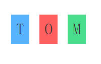
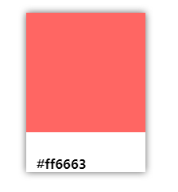
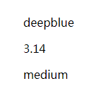

# 01-index.html
First time to use react.


# 02-component.html
Reuse of component.


# 03-style.html
Have style within React component.



# 04-card.html
pass values from parent to children


# 05-props.html
pass values from top to down by {...this.props}


# 06-state.html

- change the state of component
- use common style by {...commonStyle}


# commends
```sh
cd C:\Users\chaofanz\Desktop\data\web\webApplicationLearning\20180815ReactComponent
C:\Python37-32\python.exe -m http.server
```


# python start server
run following commend in the index folder of website
```py
python -m http.server
```


# props: propriety to accept external data
# state: internal propriety

# children: get {} content
```html
this.props.children
<Com>hello</Com>
children = hello
```
# use {...this.props} to pass from top to down
05-props.html

# plugins for atom
https://medium.com/productivity-freak/my-atom-editor-setup-for-js-react-9726cd69ad20
