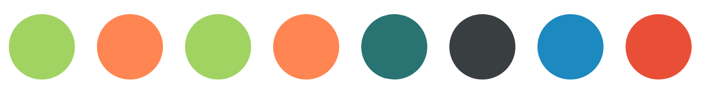
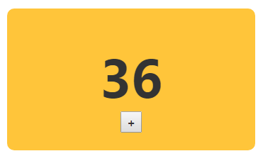

# 01-object.html

- put jsx object into variable
- draw circle
- for loop to create components

# 02-event.html

- click button to add 1 into the counter
- holding shift key to add 10 into the counter

# 03-colorizer.html

- control real DOM
-
