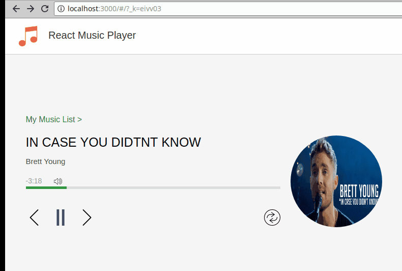

# installation
- need to install modules and run webpack before start
```sh
npm install
webpack
```

# demo 


# root.js and app component 
root.js define the main structure of the applicaiton
- 'App' component is the main component 
    - 'Header' is located 
    - control functions 
- change part 
    - 'Player' is index component  for '/' path 
    - 'MusicList' is component for '/list' path
```js
      <Router history={hashHistory}>
        <Route path="/" component={App}>
          <IndexRoute component={Player}></IndexRoute>
          <Route path="/list" component={MusicList}></Route>
        </Route>
      </Router>
```

# header.js 
define the logo and title of header 

# player.js 
define the player page 

# page/musiclist.js 
define the musiclist page 

# config/musiclist.js
define the data of music list, which should be data interface of production environment 

# musiclistitem.js 
define each row of data in music list 

# progress.js 
define the progress bar component to display and control of value bar like progress bar and volumne bar 